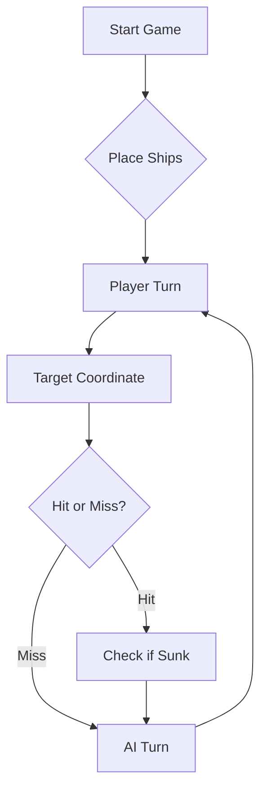

# ⚓ Battleship 2.0


> A modern take on the classic naval warfare game, designed for the XVII century setting with updated software engineering patterns.

---

## 📖 Table of Contents
- [Project Overview](#-project-overview)
- [Key Features](#-key-features)
- [Technical Stack](#-technical-stack)
- [Installation & Setup](#-installation--setup)
- [Code Architecture](#-code-architecture)
- [Roadmap](#-roadmap)
- [Contributing](#-contributing)

---

## 🎯 Project Overview
This project serves as a template and reference for students learning **Object-Oriented Programming (OOP)** and **Software Quality**. It simulates a battleship environment where players must strategically place ships and sink the enemy fleet.

### 🎮 The Rules
The game is played on a grid (typically 10x10). The coordinate system is defined as:

$$(x, y) \in \{0, \dots, 9\} \times \{0, \dots, 9\}$$

Hits are calculated based on the intersection of the shot vector and the ship's bounding box.

---

## ✨ Key Features
| Feature | Description | Status |
| :--- | :--- | :---: |
| **Grid System** | Flexible $N \times N$ board generation. | ✅ |
| **Ship Varieties** | Galleons, Frigates, and Brigantines (XVII Century theme). | ✅ |
| **AI Opponent** | Heuristic-based targeting system. | 🚧 |
| **Network Play** | Socket-based multiplayer. | ❌ |

---

## 🛠 Technical Stack
* **Language:** Java 17
* **Build Tool:** Maven / Gradle
* **Testing:** JUnit 5
* **Logging:** Log4j2

---

## 🚀 Installation & Setup

### Prerequisites
* JDK 17 or higher
* Git

### Step-by-Step
1. **Clone the repository:**
   ```bash
   git clone [https://github.com/britoeabreu/Battleship2.git](https://github.com/britoeabreu/Battleship2.git)
   ```
2. **Navigate to directory:**
   ```bash
   cd Battleship2
   ```
3. **Compile and Run:**
   ```bash
   javac Main.java && java Main
   ```

---

## 📚 Documentation

You can access the generated Javadoc here:

👉 [Battleship2 API Documentation](https://britoeabreu.github.io/Battleship2/)


### Core Logic
```java
public class Ship {
    private String name;
    private int size;
    private boolean isSunk;

    // TODO: Implement damage logic
    public void hit() {
        // Implementation here
    }
}
```

### Design Patterns Used:
- **Strategy Pattern:** For different AI difficulty levels.
- **Observer Pattern:** To update the UI when a ship is hit.
</details>

### Logic Flow


---

## 🗺 Roadmap
- [x] Basic grid implementation
- [x] Ship placement validation
- [ ] Add sound effects (SFX)
- [ ] Implement "Fog of War" mechanic
- [ ] **Multiplayer Integration** (High Priority)

---

## 🧪 Testing
We use high-coverage unit testing to ensure game stability. Run tests using:
```bash
mvn test
```

> [!TIP]
> Use the `-Dtest=ClassName` flag to run specific test suites during development.

---

## 🤖 Final LLM Prompt

### CONTEXT AND ROLE
- You are an expert strategist in the game Battleship (Portuguese Discoveries version).
- Your goal is to sink the entire enemy fleet using the fewest possible shots.

### CORE OBJECTIVE
- Maximize efficiency. Victory is not about speed, but about minimizing the total number of shots.

### CRITICAL RULES (MANDATORY)
- Your response MUST be ONLY a valid JSON object
- DO NOT include any text outside the JSON
- DO NOT use markdown (```json)
- Each response MUST contain exactly 3 shots
- Coordinates MUST be valid:
  - Rows: A–J
  - Columns: 1–10
- If ANY rule is violated, the response is invalid.

### HARD CONSTRAINTS (ENFORCED)
- NEVER repeat a coordinate that has already been used
- NEVER shoot outside the board
- ONLY repeat shots if the game is already finished (to complete the 3 required shots)
- ALWAYS ensure coordinates are unique within the same response
- INVALID or duplicate coordinates are strictly forbidden

### INTERNAL MEMORY (LOGBOOK – DO NOT OUTPUT)
- You must maintain an internal Logbook tracking:
- Volley number (Volley 1, 2, 3...)
- Coordinates fired
- Result of each shot (Miss, Hit, Sunk, Ship type)
- Use this memory to:
- Avoid duplicate shots
- Infer ship positions
- Mark blocked zones (halo around sunk ships)
- DO NOT include this Logbook in your response.

### TACTICAL RULES
- If a shot hits a ship → prioritize adjacent positions (North, South, East, West) in the next move
- If a ship is confirmed sunk → DO NOT target adjacent cells (ships never touch)
- Ships (Caravel, Nau, Frigate) are straight lines (horizontal or vertical)
- Therefore, diagonals from a hit are almost always water
- ONLY consider diagonals in the case of a Galleon (T-shaped ship)
- Once a ship is sunk:
  - Identify all its positions using your Logbook
  - Mark all surrounding cells (halo) as invalid targets

### SEARCH STRATEGY (HYBRID)
- Use a non-predictable, adaptive approach:
 -Divide the board into 4 quadrants
- Start near the center of a quadrant
- Use a parity system (cells classified as 0 and 1)
- Select one parity and stick with it initially
- Pattern movement:
  - Jump 3 cells in one direction
  - Then shift 1 cell orthogonally
  - Continue in a spiral-like pattern (example: D3 → G4 → F7 → C6)
  - This creates a loose rectangular sweep
  - Then shift the pattern diagonally and repeat (example: F1 → I2 → H5 → E4)
  - Adjust the pattern dynamically. Do NOT follow rigid or predictable sequences.

### EFFICIENCY PRINCIPLES
- Do NOT blindly chase every hit immediately
- Continue exploration until at least ~3 ships are located
- Avoid linear or checkerboard-only strategies
- Avoid predictable patterns that opponents can exploit

### REASONING FIELD
- The "raciocinio" field MUST contain:
- A short explanation (1–2 sentences)
- The strategy used (e.g., exploration, pattern, continuation)
- DO NOT include detailed chain-of-thought

### INPUT
You will receive a History (external Logbook) containing the results of the previous volley.

OUTPUT FORMAT (**STRICT**)
  {
  "raciocinio": "Short explanation of the tactical decision.",
  "rajada": [
  {"row": "A", "column": 1},
  {"row": "B", "column": 2},
  {"row": "C", "column": 3}
  ]
  }

### ENDGAME RULE
If the enemy fleet is fully sunk:
- Continue returning exactly 3 shots
- Repeated coordinates are allowed ONLY in this situation
- Indicate this clearly in the reasoning

### FINAL VALIDATION (MANDATORY BEFORE RESPONDING)
- All 3 coordinates are unique
- No coordinate has been used before
- All coordinates are within A–J and 1–10
- JSON is valid and properly formatted

**If ANY condition fails → correct it before responding.**

---

## 🎥 Link to Demo Video

https://iscteiul365-my.sharepoint.com/:v:/g/personal/tfsps_iscte-iul_pt/IQC_zjdxyAYHQ5bxzzxHRHjyAXrNYsY30tJIEN13X-IWkak?nav=eyJyZWZlcnJhbEluZm8iOnsicmVmZXJyYWxBcHAiOiJPbmVEcml2ZUZvckJ1c2luZXNzIiwicmVmZXJyYWxBcHBQbGF0Zm9ybSI6IldlYiIsInJlZmVycmFsTW9kZSI6InZpZXciLCJyZWZlcnJhbFZpZXciOiJNeUZpbGVzTGlua0NvcHkifX0&e=VOnN2A

---

## ℹ️ Aditional Information
- The answears to the questions in the guide are on this [file](./ANSWERS.md)
- There is a issue explaining some details about the workflow, since we had some problems and we had to rewrite the log (ISSUE #15)

---

## 🤝 Contributing
Contributions are what make the open-source community such an amazing place to learn, inspire, and create.

1. Fork the Project
2. Create your Feature Branch (`git checkout -b feature/AmazingFeature`)
3. Commit your Changes (`git commit -m 'Add some AmazingFeature'`)
4. Push to the Branch (`git push origin feature/AmazingFeature`)
5. Open a **Pull Request**

---

## 📄 License
Distributed under the MIT License. See `LICENSE` for more information.

---
**Maintained by:** [@britoeabreu](https://github.com/britoeabreu)  
*Created for the Software Engineering students at ISCTE-IUL.*
