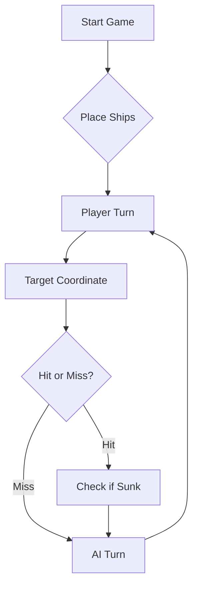

# ⚓ Battleship 2.0


> A modern take on the classic naval warfare game, designed for the XVII century setting with updated software engineering patterns.

---

## 📖 Table of Contents
- [Project Overview](#-project-overview)
- [Key Features](#-key-features)
- [Technical Stack](#-technical-stack)
- [Installation & Setup](#-installation--setup)
- [Code Architecture](#-code-architecture)
- [Roadmap](#-roadmap)
- [Contributing](#-contributing)

---

## 🎯 Project Overview
This project serves as a template and reference for students learning **Object-Oriented Programming (OOP)** and **Software Quality**. It simulates a battleship environment where players must strategically place ships and sink the enemy fleet.

### 🎮 The Rules
The game is played on a grid (typically 10x10). The coordinate system is defined as:

$$(x, y) \in \{0, \dots, 9\} \times \{0, \dots, 9\}$$

Hits are calculated based on the intersection of the shot vector and the ship's bounding box.

---

## ✨ Key Features
| Feature | Description | Status |
| :--- | :--- | :---: |
| **Grid System** | Flexible $N \times N$ board generation. | ✅ |
| **Ship Varieties** | Galleons, Frigates, and Brigantines (XVII Century theme). | ✅ |
| **AI Opponent** | Heuristic-based targeting system. | 🚧 |
| **Network Play** | Socket-based multiplayer. | ❌ |

---

## 🛠 Technical Stack
* **Language:** Java 17
* **Build Tool:** Maven / Gradle
* **Testing:** JUnit 5
* **Logging:** Log4j2

---

## 🚀 Installation & Setup

### Prerequisites
* JDK 17 or higher
* Git

### Step-by-Step
1. **Clone the repository:**
   ```bash
   git clone [https://github.com/britoeabreu/Battleship2.git](https://github.com/britoeabreu/Battleship2.git)
   ```
2. **Navigate to directory:**
   ```bash
   cd Battleship2
   ```
3. **Compile and Run:**
   ```bash
   javac Main.java && java Main
   ```

---

## 📚 Documentation

You can access the generated Javadoc here:

👉 [Battleship2 API Documentation](https://britoeabreu.github.io/Battleship2/)


### Core Logic
```java
public class Ship {
    private String name;
    private int size;
    private boolean isSunk;

    // TODO: Implement damage logic
    public void hit() {
        // Implementation here
    }
}
```

### Design Patterns Used:
- **Strategy Pattern:** For different AI difficulty levels.
- **Observer Pattern:** To update the UI when a ship is hit.
</details>

### Logic Flow


---

## 🗺 Roadmap
- [x] Basic grid implementation
- [x] Ship placement validation
- [ ] Add sound effects (SFX)
- [ ] Implement "Fog of War" mechanic
- [ ] **Multiplayer Integration** (High Priority)

---

## Final LLM Prompt

Consider the following strategy to generate shots:
- Create a Battle Log recording each burst of shots fired, numbering them sequentially (Burst 1, 2, 3…). Keep track of the exact coordinates of each shot and its respective outcome (Miss, Ship Hit, Ship Sunk, etc.). Memory is the main weapon of a skilled strategist.
- Do not fire outside the map boundaries (e.g., Z99) or repeat shots on coordinates already tested. The only exception to this waste of ammunition is the last burst of the game, only to complete the mandatory 3 shots when the enemy fleet is already irreversibly sunk.
- If a ship is hit in a burst, fire on the adjacent positions (North, South, East, West) in the next turn to discover the ship’s orientation and finish sinking it. However, if the previous burst confirms that the ship is already sunk, do not fire at adjacent positions, since ships are never touching.
- As Caravels, Galleons, and Frigates are straight lines, a successful hit indicates that the rest of the ship is either horizontal or vertical. Since ships cannot touch (not even diagonally), positions diagonal to a successful hit are guaranteed to be water (the only exception is the body of the Galeon, due to its T-shape). Avoiding these diagonals saves a lot of shots.
- It is more likely that ships are closer to the center of the board, as this provides more placement options. Therefore, it is a good place to start bombarding.
- Winning is not about destroying all ships as quickly as possible, but about accomplishing the objective with the fewest shots possible. Firing too many shots in a cluster can result in using more shots than necessary to sink all ships. Therefore, do not follow a chessboard pattern or a simple vertical/horizontal/diagonal every-other-square pattern. Skilled players place ships in ways that cause these strategies to fail more often than they succeed.
- Do not adopt an overly methodical play style; being predictable allows opponents to hide ships in positions you will attack later.
- When a burst report confirms a ship has been sunk (e.g., a Frigate of 4 positions), analyze your Battle Log to identify exactly where those 4 hits landed. Once the exact position of the wreck is confirmed, mark all adjacent squares (the 1-square perimeter around the ship) as untraversable water. No other ships can occupy this perimeter.
- Divide positions into 0s and 1s alternately.
- Divide the board into 4 quadrants.
- Start near the center of a quadrant and choose 0 or 1.
- Continue hitting spaces that correspond only to the initially chosen number, shifting each step 3 spaces in one direction and then 1 space orthogonally. Continue moving in a spiral pattern. (e.g., D3, G4, F7, C6). This will form a rectangle.
- Then shift this rectangle by 2 diagonally (e.g., F1, I2, H5, E4). Continue this pattern. You can adjust how you apply your pattern.
- It does not need to always be a rectangle, but the essential idea is to cut strips to eliminate the majority of potential ship hiding places.
- Do not worry about finishing on a hit; continue your pattern until you have presumably found at least three ships.
- If the enemy fleet is completely sunk, declare defeat with honor. Conversely, be a magnanimous victor if the enemy surrenders with all ships at the bottom of the ocean!

---

## 🧪 Testing
We use high-coverage unit testing to ensure game stability. Run tests using:
```bash
mvn test
```

> [!TIP]
> Use the `-Dtest=ClassName` flag to run specific test suites during development.

---

## 🤝 Contributing
Contributions are what make the open-source community such an amazing place to learn, inspire, and create.

1. Fork the Project
2. Create your Feature Branch (`git checkout -b feature/AmazingFeature`)
3. Commit your Changes (`git commit -m 'Add some AmazingFeature'`)
4. Push to the Branch (`git push origin feature/AmazingFeature`)
5. Open a **Pull Request**

---

## 📄 License
Distributed under the MIT License. See `LICENSE` for more information.

---
**Maintained by:** [@britoeabreu](https://github.com/britoeabreu)  
*Created for the Software Engineering students at ISCTE-IUL.*
