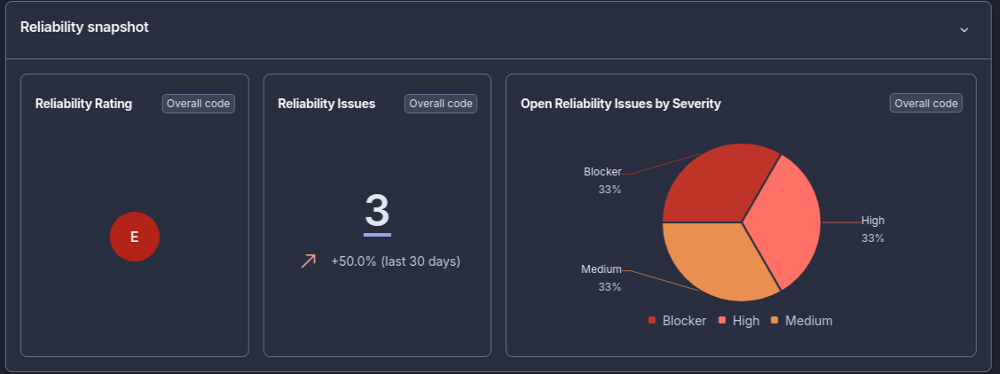
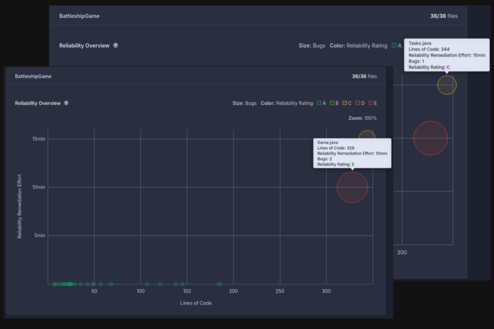
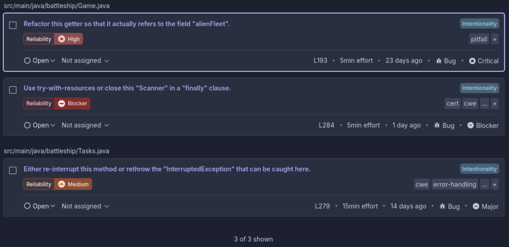

# Relatório de Qualidade de Código - SonarQube Cloud

**Nome:** Manuel Albuquerque
**Número:** 123010

---

## Análise de Reliability (Fiabilidade)

A análise individual focou-se na vertente de Reliability, avaliando a estabilidade do software e a presença de erros lógicos que possam comprometer a execução do projeto.

### 1. Snapshot de Qualidade (Geral)

Através do snapshot, observa-se que o projeto apresenta um **Rating E** em Reliability, o nível mais baixo da escala. Foram identificadas 3 issues no total, com uma distribuição de severidade crítica: **1 Blocker, 1 High e 1 Medium**.

A presença de uma issue classificada como *Blocker* indica a existência de uma falha grave que pode causar o encerramento inesperado da aplicação ou erros críticos de processamento, exigindo intervenção imediata para garantir a viabilidade do jogo.

### 2. Evolução e Densidade (Graph)

O gráfico de dispersão permite cruzar o volume de código (Lines of Code) com o esforço de remediação e o rating por classe:

* **Classe Game:** Identificada como o ponto mais crítico. Apesar de ter um volume de código moderado, concentra 2 erros (incluindo o Blocker), o que resulta no Rating E. O esforço estimado para correção é de 10 minutos.
* **Classe Tasks:** Embora apresente uma maior quantidade de linhas de código, possui uma fiabilidade superior (Rating C), contendo apenas 1 bug. Contudo, o tempo de remediação é superior, sugerindo uma resolução mais complexa.

Esta análise demonstra que a densidade de erros não está diretamente correlacionada ao tamanho do ficheiro, mas sim à complexidade da lógica implementada em cada módulo.

### 3. Detalhe de Problemas (Issues)

O detalhamento das issues permite uma abordagem de correção direcionada:
* **Distribuição:** Foram validados dois bugs na classe Game (High e Blocker) e um na classe Tasks (Medium).
* **Suporte à Correção:** O SonarQube indica a localização exata no código e sugere a solução técnica (*How to fix*). Esta funcionalidade é fundamental para garantir que as correções não introduzam novos problemas e sigam as boas práticas de desenvolvimento em Java.

---

## Conclusão
A análise técnica revela a necessidade urgente de refactorização da classe Game para elevar o patamar de fiabilidade do projeto. A priorização deve focar-se na issue Blocker, reduzindo o risco de falhas em runtime e melhorando a estabilidade geral do sistema antes da integração final no branch main.
